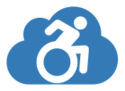

# Introduction 

MyBlog is an accessible blog engine.
It was created to have a real solution for developers that are looking for a inclusive Blog.
This project start in january 2017. An exemple of Blog who is using this code is [BugHunter](https://www.bugshunter.net) 

It could be used to teach accessibility ;).

# Features
This blog engine include many features :
- Open Live Writer (it is the only way to manage blog's content). No security issues due to admin apges or something else.
- Azure (with PAAS).
- Accessible design.
- Accessible theme.
- Accessible Forms (Contact, Comments...).
- Greate respect of HTML standrads.
- Many SOE improvements (SiteMap, Pages...).
- Ability to posts comment.
- Authentification prior to comment.
- Authentication via social media accounts (Microsoft, Google, Twitter, FaceBook)
- Separation of blogger credentials from regular users informations.
- GDPR complient.
- HTTP to HTTPS redirection.
- Default domaine name to WWW domaine version redirection.
- Warmup with Azure web apps slot swipe.
- en-US and fr-FR localisation.
- ... and so many more to document ...

# Getting Started
## 1. Software requierments.

To edit and build this code, you need the .net Framework 4.7 and Visual Studio 2017 (Community, Pro, or Enterprise).

Some extension are used, but not requested :
- [Web Essentials 2017](https://marketplace.visualstudio.com/items?itemName=MadsKristensen.WebExtensionPack2017) to include image in CSS.
- [Multilingual App Toolkit v4.0](https://marketplace.visualstudio.com/items?itemName=MultilingualAppToolkit.MultilingualAppToolkit-18308) to include translations.
- Azure Storage Emulator (for development)

Deploiment requirements :
- An Azure subscription
- Azure SQL Database.
- Azure Storage Account (for blob).

## 2. Installation process
To use this code follow this steps :
- Clone this reposotory.
- Cutomize the configuration file (many settings are available in this `appSettings` section)
- Cutomize the layou file (many settings are available in this `_Layout.cshtml` section)
- Run and enjoy ;)

## 3. User creation and credentials
The user/credentials (login and password) is created when you configure your blog in Open Live Writer. The login and password passed will set the first user.

If you want to change or delete those credentials. Juste remote it from the `Publisher` table of your database. Edit your Open Live Writer account and it will create a new credential.

# Contribute
Contributions are open. Juste send your ideas or Pull Request ;)